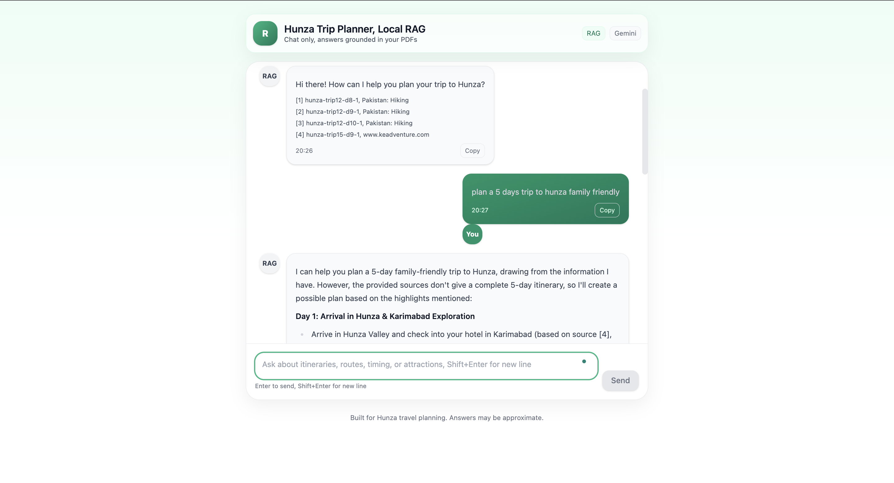

# Hunza Trip Planner (Local RAG)

FastAPI + Gemini Flash generator with BM25/Chroma retrieval over local itinerary PDFs.

## Run
```bash
conda activate rag_hunza
pip install -r requirements.txt
export GOOGLE_API_KEY=...   # or put it in .env
python -m src.ingest        # builds BM25; vectors optional
uvicorn src.server:app --reload --port 8000


## Structure
    *src/extract_text.py → PDF → TXT
    *src/parse_days.py → TXT → JSONL (days)
    src/ingest.py → JSONL → BM25 + Chroma
    *src/retriever.py / src/generator.py / src/chat.py
    *web/index.html → frontend (no build)


Gotcha — here’s a **drop-in “Detailed Description”** you can paste into your GitHub repo’s **About** and **README.md**.

---

### 🔹 GitHub “About” (one-liner)

> Local Hunza trip planner (RAG): FastAPI + Gemini Flash + BM25/Chroma over your own itinerary PDFs, with a no-build React/Tailwind UI + citations.

---

### 📘 README.md (detailed)

```markdown
# Hunza Trip Planner — Local RAG

A local, document-grounded trip planner for the Hunza region.  
It extracts text from your itinerary PDFs, parses day-by-day plans, builds search indexes (BM25 + optional vector search via Chroma), and answers questions through Gemini Flash with **attribution to the exact PDF chunks** used.


---

## ✨ Features

- **RAG over your PDFs**: PDF → text → structured days → searchable chunks.
- **Hybrid retrieval**: BM25 always-on (+ optional Chroma/vector); keyword boosts for Hunza places.
- **Citations**: every answer lists the specific chunk(s) used.
- **Local UI**: single-file React (UMD) + Tailwind; no build tools required.
- **FastAPI API**: `/api/chat` for programmatic access.
- **Safe env handling**: `.env` for API keys; secrets ignored by git.

---

## 🧭 Architecture

```

PDFs (data/raw_pdfs)
│
├─ extract_text.py      →  TXT (data/staging_txt)
├─ parse_days.py        →  JSONL with day blocks (data/curated/itineraries.jsonl)
├─ ingest.py            →  BM25 (.bm25.pkl) + Chroma vectors (.chroma/)
├─ retriever.py         →  hybrid search (BM25 + vector fallback)
├─ generator.py         →  Gemini Flash answer with citations
├─ chat.py              →  CLI wrapper for quick testing
└─ server.py            →  FastAPI: /api/chat + serves web UI

web/index.html  → Frontend (filters + chat bubbles + Markdown rendering)

```

**Retrieval details**
- **BM25** (rank_bm25) runs locally and is **always** available.
- **Vector search** (Chroma + Sentence Transformers) is optional; if it fails, the app automatically uses BM25 only.
- **Keyword boost & filter**: hunza/karimabad/altit/baltit/duiker/attabad/passu/hussaini/etc are boosted; islamabad/lahore/airport/contingency are de-boosted or filtered.

---

## 🛠️ Requirements

- Python 3.9 (miniconda recommended)
- `pip install -r requirements.txt`
- Google Gemini API key in `.env`

> On macOS, if you see NumPy/Torch mismatches, pin:
> `numpy==1.26.4`, `torch==2.2.2` (already in `requirements.txt`).

---

## 🔑 Environment variables

Create `.env` in the repo root:

```

GOOGLE_API_KEY=your_gemini_key
GEMINI_MODEL=gemini-2.0-flash

````

We load this automatically in `src/utils.py`:
```py
# loads repo-root .env and overrides empty shell vars
load_dotenv(ROOT / ".env", override=True)
````

---

## 🚀 Quickstart

```bash
# 0) Activate env
conda activate rag_hunza

# 1) Put PDFs here
mkdir -p data/raw_pdfs/hunza_itineraries
# (drop your Hunza itinerary PDFs into that folder)

# 2) Extract & parse
python -m src.extract_text
python -m src.parse_days

# 3) Build indexes
python -m src.ingest       # creates .bm25.pkl and (optionally) .chroma/

# 4) Run API + UI
uvicorn src.server:app --reload --port 8000
# open http://127.0.0.1:8000
```

---

## 🖥️ Frontend (no build)

* `web/index.html` uses **React UMD + Tailwind** from CDNs.
* Markdown answers are rendered with **marked** + **DOMPurify** for safety.
* Controls at top (Days/Month/Base/checkboxes) compose a helpful default query.
* Right sidebar shows **citations** with chunk id, title, day, and text preview.

**Tip:** To make the chat pane **expand with messages**, we removed fixed height:

```html
<!-- section has no fixed h-[70vh]; page scrolls naturally -->
<section class="md:col-span-2 bg-white rounded-2xl shadow p-4">
```

---

## 🧩 API

### `POST /api/chat`

**Request**

```json
{
  "message": "Family friendly 5 day plan in October, base in Karimabad"
}
```

**Response**

```json
{
  "answer": "Markdown text ...",
  "citations": [
    {
      "id": "hunza-trip6-d7-1",
      "text": "[Day 7] Breakfast ...",
      "meta": { "id":"hunza-trip6", "title":"Package: 10 DAYS TOUR...", "day":7, "source_file":"hunza-trip6" }
    }
  ]
}
```

---

## 📦 Repo layout

```
data/
  raw_pdfs/hunza_itineraries/   # your PDFs (ignored by git)
  staging_txt/                  # extracted .txt files
  curated/itineraries.jsonl     # parsed days

src/
  extract_text.py               # PDF → TXT (PyPDF + fallback soup)
  parse_days.py                 # TXT → per-day blocks (regex; handles duplicates)
  ingest.py                     # builds BM25; vectors optional; sanitized metadata
  retriever.py                  # hybrid rank + boosts + hunza-only filter
  generator.py                  # Gemini Flash; structured prompt; citations
  chat.py                       # CLI quick tester
  server.py                     # FastAPI; /api/chat + static web
  utils.py                      # env helpers; dotenv loading

web/
  index.html                    # UI (React UMD + Tailwind)
  favicon.svg                   # simple “R” icon
```

---

## 🔒 Security & privacy

* **Do NOT commit** `.env` or raw PDFs. See `.gitignore`.
* Rotate your Gemini key if it was ever printed into a terminal/screenshot.
* All retrieval happens locally; only the final prompt + selected text is sent to Gemini.

---

## 🧹 Noise / logs

Suppress common warnings:

```bash
export ANONYMIZED_TELEMETRY=False   # Chroma
export GRPC_VERBOSITY=ERROR         # gRPC (Google SDK)
export GLOG_minloglevel=3           # absl/glog
```

(These are also set within `server.py`.)

---

## 🐞 Troubleshooting

* **`.bm25.pkl not found`**
  Run `python -m src.ingest` first. We also fail fast in `retriever.py` with a helpful message.

* **Vector index failed: metadata value is a list**
  `ingest.py` flattens lists via `sanitize_meta()`; ensure you’ve pulled latest code.

* **NumPy 2.0 + Torch mismatch**
  Pin: `numpy==1.26.4`, `torch==2.2.2`. Reinstall with `--no-cache-dir` if needed.

* **Missing key** (`GOOGLE_API_KEY`)
  Ensure `.env` exists at repo root and our `utils.py` loads it (override=True). Clear any bad shell export: `unset GOOGLE_API_KEY`.

* **ModuleNotFoundError: src**
  Run commands from **repo root** (not from `web/`). Or set `PYTHONPATH=..`.

* **Chroma ‘include ids’ error**
  We use: `include=["documents","metadatas","distances"]` (no `"ids"` in include for older clients).

---

## 🗺️ Roadmap

* Streaming answers (SSE) for typing effect
* Month/season-aware scoring (weather/open road heuristics)
* Export to PDF / Markdown / WhatsApp share
* Multi-region templates (Skardu, Fairy Meadows, Naran)
* Lightweight on-device embedding model option

---

## 📜 License

MIT (see `LICENSE`).

---

## 🙌 Acknowledgements

* Sentence-Transformers, Chroma, FastAPI, Tailwind, marked, DOMPurify.
* The PDFs you provided under your own usage rights.

````

---

### 🧾 .gitignore (include this too)

```gitignore
__pycache__/
*.py[cod]
*.ipynb_checkpoints

.env
.env.*
.venv/
venv/

.chroma/
.bm25.pkl
data/raw_pdfs/

.DS_Store
.vscode/
````

If you want, I can also generate a crisp **repo description + topics** list for GitHub (e.g., `rag`, `fastapi`, `chroma`, `gemini`, `bm25`, `tailwind`, `react-umd`).
